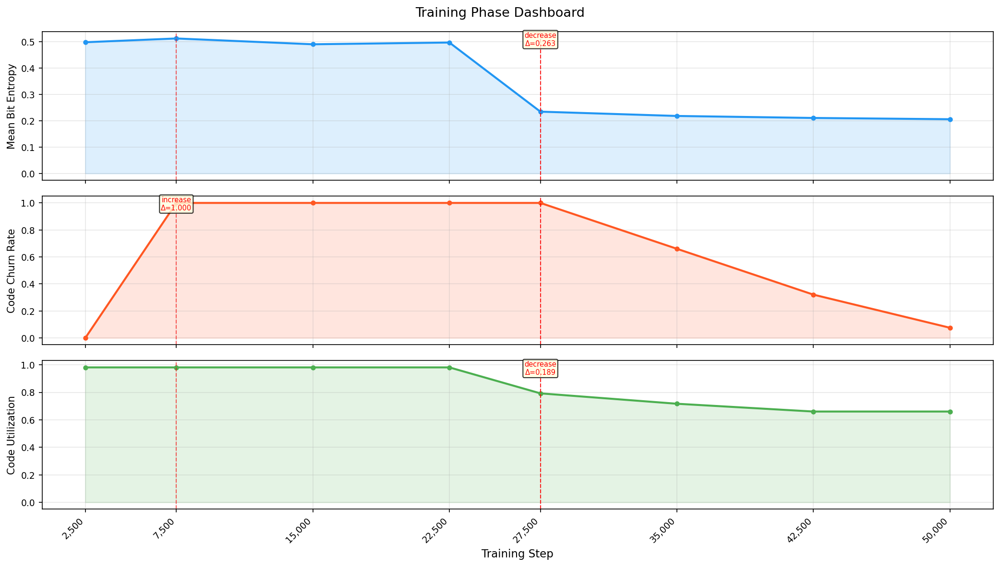
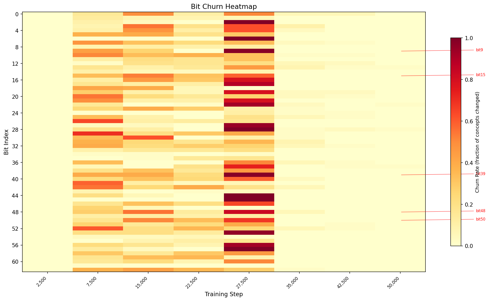
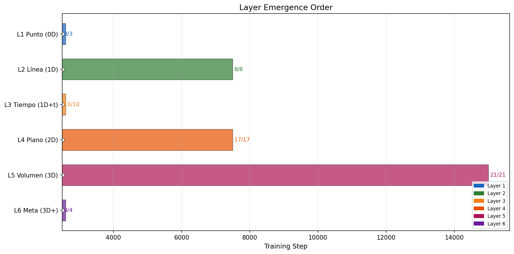
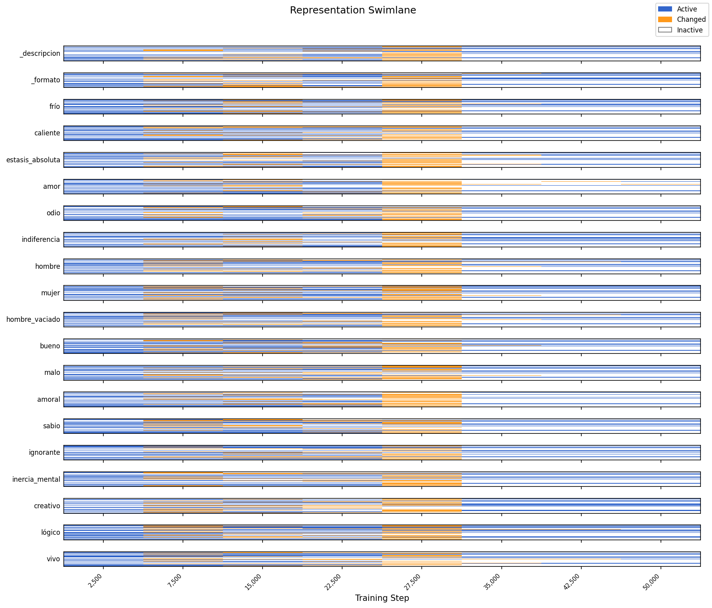

# reptimeline

**Track how discrete representations evolve during training.**

reptimeline detects when concepts "are born" (first become distinguishable), when they "die" (collapse), when relationships form between concept pairs, and where phase transitions occur in representation dynamics.

Works with any discrete bottleneck: triadic bits, VQ-VAE codebooks, FSQ levels, sparse autoencoders, concept bottleneck models, or binary codes.

## Why this exists

Every system that quantizes neural representations into discrete codes faces the same blind spot: **you can see what the codes look like after training, but not how they got there.**

Current tools log scalar metrics (codebook utilization, perplexity, loss) to WandB/TensorBoard. These tell you *that* something changed, not *what* changed. When codebook collapse happens at step 27,500, you want to know: which codes died? Did they die together? Did a phase transition cause it? Which concepts lost their unique representations?

reptimeline answers these questions for any discrete representation system.

## What it does that nothing else does

| Capability | reptimeline | VQ-VAE tools | SAE-Track | CBM tools | RepE |
|---|---|---|---|---|---|
| Per-code lifecycle (birth/death) | Yes | No | Partial | No | No |
| Connection tracking between concepts | Yes | No | No | No | No |
| Automatic phase transition detection | Yes | No | Manual (3-phase) | No | No |
| Per-element stability scores | Yes | No | Drift only | No | No |
| Churn heatmap (bit x step) | Yes | No | No | No | No |
| Hierarchical dependency tracking | Yes | No | No | No | No |
| Backend-agnostic | Yes | No | SAE-only | No | LLM-only |

**Closest competitor**: SAE-Track (Xu et al., 2024) tracks feature formation in sparse autoencoders but operates on continuous vectors without discretization, lifecycle events, or connection tracking.

## Who benefits

- **VQ-VAE / VQ-GAN researchers**: Track individual codebook entry lifecycles instead of just aggregate utilization. Diagnose exactly when and why collapse happens.
- **FSQ researchers**: FSQ eliminates collapse by design, but codes still redistribute during training. reptimeline shows how.
- **Sparse autoencoder / mechanistic interpretability**: Threshold SAE features into active/inactive and track when interpretable features emerge, stabilize, or disappear.
- **Concept bottleneck models**: Track when hierarchical concept dependencies are learned and verify mutual exclusivity of opposing concepts.
- **Representation engineering**: Discretize representation directions and track how they evolve during fine-tuning or RLHF.
- **LLM interpretability (Claude, GPT, Llama)**: Apply via SAEs — see section below.

## Applying to large language models

reptimeline is not limited to small discrete-bottleneck models. Any LLM can be analyzed by converting its continuous representations into discrete codes via a Sparse Autoencoder (SAE).

### The connection

Anthropic, OpenAI, and others already train SAEs on LLM hidden states to discover interpretable features (e.g., "feature 31,247 activates when text discusses the Golden Gate Bridge"). What they don't do is track those features as **entities with lifecycles** — when they are born during training, when they die, which ones are opposites, which ones depend on each other.

reptimeline adds that missing layer.

### How it works

```
LLM hidden states (continuous, 4096+ dims)
        |
        v
Sparse Autoencoder (SAE)
        |  decomposes into interpretable features
        v
Threshold (activation > t → 1, else → 0)
        |  converts to binary code
        v
ConceptSnapshot  ← reptimeline takes over here
        |
        v
BitDiscovery → AutoLabeler → Reconciler
```

### Example SAE extractor

```python
class SAEExtractor(RepresentationExtractor):
    """Extract discrete codes from an LLM via a Sparse Autoencoder."""

    def __init__(self, sae_path, threshold=0.5):
        self.sae_path = sae_path
        self.threshold = threshold

    def extract(self, checkpoint_path, concepts, device='cpu'):
        model = load_language_model(checkpoint_path)
        sae = load_sae(self.sae_path)
        codes = {}
        for concept in concepts:
            hidden = model.get_hidden_state(concept)
            features = sae.encode(hidden)
            binary = [1 if f > self.threshold else 0 for f in features]
            codes[concept] = binary
        return ConceptSnapshot(
            step=parse_step(checkpoint_path), codes=codes
        )

    def similarity(self, code_a, code_b):
        # Jaccard on active features
        a = set(i for i, v in enumerate(code_a) if v == 1)
        b = set(i for i, v in enumerate(code_b) if v == 1)
        union = a | b
        return len(a & b) / len(union) if union else 1.0

    def shared_features(self, code_a, code_b):
        return [i for i in range(min(len(code_a), len(code_b)))
                if code_a[i] == 1 and code_b[i] == 1]
```

Then the entire reptimeline pipeline works unchanged:

```python
extractor = SAEExtractor("sae_llama3_layer12.pt")
snapshots = extractor.extract_sequence("llama3_checkpoints/", concepts)
tracker = TimelineTracker(extractor)
timeline = tracker.analyze(snapshots)

# Discover what each SAE feature means
discovery = BitDiscovery()
report = discovery.discover(snapshots[-1], timeline=timeline)

# Name them automatically
labeler = AutoLabeler()
labels = labeler.label_by_llm(report, llm_fn=call_claude)

# See the full lifecycle
timeline.print_summary()
# → "Feature 42 was born at step 10,000, died at step 50,000"
# → "Features 42 and 187 are duals (anti-correlated)"
# → "Feature 99 depends on feature 12 (never activates without it)"
```

### What already exists vs. what reptimeline adds

| Capability | Anthropic (SAE + circuit tracing) | reptimeline |
|---|---|---|
| Decompose hidden states into features | Yes (SAE) | No (uses existing SAEs) |
| Name individual features | Yes (manual + LLM) | Yes (AutoLabeler, 3 strategies) |
| Track feature LIFECYCLE across training | **No** | **Yes** (births, deaths, stability) |
| Discover DUALS (anti-correlated features) | **No** | **Yes** (automatic) |
| Discover DEPENDENCIES (feature hierarchies) | **No** | **Yes** (automatic) |
| Detect PHASE TRANSITIONS in features | **No** | **Yes** (statistical detection) |
| Compare discovered vs. expected structure | **No** | **Yes** (Reconciler) |
| Suggest corrections to training | **No** | **Yes** (anchor corrections) |

### What you need

- Training checkpoints of an LLM (public for Llama, Mistral, Pythia, OLMo)
- A trained SAE on that model's hidden states (available for Pythia, Llama via EleutherAI and others)
- reptimeline (this package)

With open-source LLMs and public SAEs, this is feasible **today**.

## Architecture

```
reptimeline/
  core.py                  # ConceptSnapshot, CodeEvent, ConnectionEvent,
                           # PhaseTransition, Timeline (all backend-agnostic)
  tracker.py               # TimelineTracker: births, deaths, connections,
                           # entropy/churn/utilization curves, stability,
                           # phase transition detection
  discovery.py             # BitDiscovery: discover what each bit means
                           # without prior knowledge (bottom-up)
  autolabel.py             # AutoLabeler: translate bits to words using
                           # embeddings, contrastive analysis, or LLMs
  reconcile.py             # Reconciler: compare discovered vs theoretical
                           # ontology, suggest corrections in both directions
  extractors/
    base.py                # RepresentationExtractor ABC (implement this)
    triadic.py             # TriadicExtractor (proof-of-concept backend)
  overlays/
    primitive_overlay.py   # Triadic-specific: layer emergence, dual coherence,
                           # dependency chain completion
  viz/
    swimlane.py            # Per-concept bit activation grid
    phase_dashboard.py     # 3-panel entropy/churn/utilization + transitions
    churn_heatmap.py       # Per-bit churn rate heatmap (63 bits x N steps)
    layer_emergence.py     # Hierarchical layer activation order
  cli.py                   # Command-line interface
  tests/
    test_smoke.py          # Synthetic smoke test (no checkpoints needed)
    test_discovery.py      # BitDiscovery tests
    test_reconcile.py      # Reconciler test against real checkpoints
```

### Four-layer design

1. **Extractors** (backend-specific): Load a checkpoint, run concepts through the model, produce a `ConceptSnapshot` with discrete codes. You implement one `extract()` method.

2. **Tracker** (backend-agnostic): Consumes a sequence of `ConceptSnapshot`s and computes all lifecycle events and metric curves. Works identically regardless of backend.

3. **Discovery** (backend-agnostic): Analyzes a trained model's codes WITHOUT any prior ontology. Discovers what each bit encodes, finds dual pairs, dependency chains, and hierarchy — all from the data. AutoLabeler translates discovered bits to human-readable words.

4. **Overlays** (domain-specific, optional): Add domain knowledge on top of the generic timeline. The `PrimitiveOverlay` maps events to the 63-primitive hierarchy; a VQ-VAE overlay might map to semantic clusters. The `Reconciler` compares discovery results with overlay definitions to find mismatches and suggest corrections.

## Adding a new backend

Implement `RepresentationExtractor` with three methods:

```python
from reptimeline.extractors.base import RepresentationExtractor
from reptimeline.core import ConceptSnapshot

class MyExtractor(RepresentationExtractor):
    def extract(self, checkpoint_path, concepts, device='cpu'):
        # Load model, run concepts, return snapshot
        codes = {}
        for concept in concepts:
            codes[concept] = get_discrete_code(model, concept)  # List[int]
        return ConceptSnapshot(step=parse_step(checkpoint_path), codes=codes)

    def similarity(self, code_a, code_b):
        # Jaccard, Hamming, or domain-specific similarity
        ...

    def shared_features(self, code_a, code_b):
        # Indices where both codes are active
        ...
```

Then:
```python
from reptimeline import TimelineTracker

extractor = MyExtractor()
snapshots = extractor.extract_sequence("checkpoints/", concepts)
tracker = TimelineTracker(extractor)
timeline = tracker.analyze(snapshots)
timeline.print_summary()
```

## Proof-of-concept results

Ran against TriadicGPT (40M params, 63 triadic bits, 8 checkpoints from step 2,500 to 50,000):

```
============================================================
  REPRESENTATION TIMELINE
============================================================
  Steps:              2,500 -> 50,000 (8 checkpoints)
  Concepts tracked:   53
  Code dimension:     63

  Bit births:         2,632
  Bit deaths:         1,732
  Connections formed: 1,378
  Phase transitions:  3

  Code churn:         0.000 -> 0.075
  Code utilization:   0.981 -> 0.660
  Mean entropy:       0.4986 -> 0.2061

  Phase transitions:
    step 27,500  entropy          decrease delta=0.2626
    step  7,500  churn_rate       increase delta=1.0000
    step 27,500  utilization      decrease delta=0.1887
============================================================
```

### Key findings

**Phase transition at step ~27,500**: Entropy drops from 0.50 to 0.23, utilization drops from 0.98 to 0.66, churn peaks then collapses. The model undergoes a "representation crystallization" — it commits to which bits encode which concepts.

**Training phases detected**:
1. **Exploration** (steps 0–7,500): High churn, all bits being tested
2. **Consolidation** (steps 7,500–27,500): Churn stays high but entropy is stable — the model is actively reorganizing
3. **Crystallization** (step 27,500): Simultaneous drop in entropy and utilization — the model "decides"
4. **Stabilization** (steps 27,500–50,000): Churn drops to 0.075, representations frozen

**Dual coherence** (anti-correlation of semantic opposites):
- placer/dolor: 1.00 (perfect anti-correlation)
- libertad/control: 0.94
- vida/muerte: 0.88
- verdad/mentira: 0.50 (worst — model struggles with this pair)

**Least stable bits**: bit 39 (eterno_obs), bit 48 (hacer), bit 15 (tacto) — these keep flipping throughout training, suggesting the model hasn't fully resolved these concepts.

### Visualizations

| Phase Dashboard | Churn Heatmap |
|---|---|
|  |  |

| Layer Emergence | Swimlane |
|---|---|
|  |  |

## Discovery: bottom-up ontology without human labels

The most novel capability. Train a model with NO predefined primitives, then let reptimeline discover what the model learned on its own.

### The problem

Existing approaches (VQ-VAE, SAE, CBM) train discrete representations and then a human inspects them post-hoc. There's no automated way to:
- Name what each code element encodes
- Find which elements are opposites
- Find dependency hierarchies (element B never activates without element A)
- Compare what the model learned vs. what a theory predicts

### The pipeline

```
Train model (unsupervised)
        |
        v
  BitDiscovery ──────────> Discovers: bit semantics, duals,
  (no theory needed)        dependencies, hierarchy
        |
        v
  AutoLabeler ────────────> Translates bits to words:
  (3 strategies)            "bit 7 = physicality"
        |
        v
  export_as_primitives() ─> discovered_primitives.json
        |                   (same format as manual primitives)
        v
  Reconciler ─────────────> Compares discovered vs. manual,
  (optional)                suggests corrections BOTH ways
```

### Step 1: Discover what each bit means

```python
from reptimeline import BitDiscovery

discovery = BitDiscovery()
report = discovery.discover(snapshot, timeline=timeline)
discovery.print_report(report)
```

Output (from real TriadicGPT checkpoint):
```
  MOST ACTIVE BITS (what activates most concepts)
    bit  1  rate=1.00  [fire, water, earth, stone, wind]
    bit  2  rate=1.00  [fire, water, earth, stone, wind]
    bit 44  rate=1.00  [fire, water, earth, stone, wind]

  DISCOVERED DUALS (18 pairs)
    bit  7 <-> bit 16  corr=-0.567  (excl=53, both=0)
    bit 10 <-> bit 23  corr=-0.486  (excl=52, both=0)

  DISCOVERED DEPENDENCIES (425 edges)
    bit  1 -> bit  0  P(parent|child)=1.00  support=6
    bit  2 -> bit  0  P(parent|child)=1.00  support=6

  DISCOVERED HIERARCHY (from timeline)
    Layer 1: bits [1, 2, 8, 44]  stable at step 2,500
    Layer 2: bits [7, 11, 24, 48]  stable at step 17,500
```

### Step 2: Translate bits to words

Three strategies, from simplest to most accurate:

```python
from reptimeline import AutoLabeler

labeler = AutoLabeler()

# A) Embedding centroid: "what word is closest to the centroid of active concepts?"
labels = labeler.label_by_embedding(report, embeddings)

# B) Contrastive: "what word best separates active from inactive concepts?"
labels = labeler.label_by_contrast(report, embeddings)

# C) LLM: "what do fire, water, earth, stone have in common?" → "physicality"
labels = labeler.label_by_llm(report, llm_fn=my_api_call)

labeler.print_labels(labels)
```

The LLM strategy works like Anthropic's SAE feature naming — send the activation pattern to any LLM and ask for a label. The prompt is:

> "These concepts activate bit 7: fire, water, earth, stone, metal.
> These do NOT: love, truth, freedom, hope.
> What property do the activating concepts share? Answer in one or two words."

### Step 3: Export as discovered primitives

```python
labeler.export_as_primitives(labels, "discovered_primitives.json")
```

This generates a file in the same format as `primitivos.json` — but discovered automatically, not defined by a human. You can use it to:
- Retrain with discovered primitives as supervision targets
- Compare with a manually defined ontology
- Iterate: train → discover → refine → retrain

### Step 4: Reconcile with theory (optional)

```python
from reptimeline import Reconciler, PrimitiveOverlay

overlay = PrimitiveOverlay()
reconciler = Reconciler(overlay)
recon = reconciler.reconcile(report, snapshot.codes)
reconciler.print_report(recon)
```

Real output from TriadicGPT:
```
  RECONCILIATION REPORT
  Agreement score:     44.4%
  Critical:            35

  BIT MISMATCHES
    !! [CRITICAL] Bit 62 (menos) is dead but theory assigns it
       -> Add more training examples that should activate this bit
    !  [WARNING] Bit 1 (información) activates for 100% of concepts
       -> Add negative examples to make it selective

  DUAL MISMATCHES
    Theory says mal/bien are duals, but model shows no anti-correlation
    Model shows eje_vertical/gusto as duals, but theory doesn't list them

  SUGGESTED CORRECTIONS
  For retraining (fix anchors):
    + Add anchors for 'mal' (bit 21): Bit is dead
    ~ Modify targets for 'información' (bit 1): Too many activations
  For theory (fix primitivos.json):
    + Add dual pair: ['eje_vertical', 'gusto'] (corr=-0.567)
    + Add dep: vacío -> fuerza (conf=1.00)
```

The reconciler suggests corrections in **both directions**:
- **Fix the model**: generate better training anchors
- **Fix the theory**: update the manual ontology based on what the model discovered

This closes the loop: Train → Discover → Compare → Correct → Retrain.

### Triadic dependency discovery: 3-way interactions

Pairwise analysis (duals, dependencies) misses emergent properties that only appear when multiple elements combine. BitDiscovery includes a triadic dependency scanner that finds **AND-gate interactions**: cases where bit `r` activates when bits `i` AND `j` are both active, but NOT when either is active alone.

**Detection criterion**: P(r|i,j) > threshold, but P(r|i) < threshold and P(r|j) < threshold.

**Interaction strength**: `interaction_strength = P(r|i,j) - max(P(r|i), P(r|j))`

This is analogous to **epistasis in genetics** — the phenotype (bit r) depends on the combination of genotypes (bits i, j) in a way that neither predicts alone. In representation learning, it means the model has learned a genuinely emergent property that is invisible to any tool analyzing features individually or in pairs.

Example from test data (37 active bits):
```
bit 2 + bit 5 -> bit 13
  P(r|i,j) = 1.00   (always active when both present)
  P(r|i)   = 0.43   (weak alone)
  P(r|j)   = 0.50   (weak alone)
  interaction_strength = 0.50
```

**Complexity**: O(K^3) where K = number of active bits. With ~37 active bits in the triadic system, that is ~50,000 candidate triples (~23,000 after symmetry) — runs in seconds on CPU.

**No equivalent in existing tools**: Sparse autoencoder features (Anthropic, OpenAI) are analyzed individually or in pairs. Circuit tracing finds computational paths but does not scan for emergent AND-gate interactions across all feature triples. reptimeline is the first tool to perform systematic triadic dependency discovery on discrete representations.

## What reptimeline replaces

The TriadicGPT project required months of manual work to define, validate, and correct an ontology of 63 primitives. reptimeline automates most of that pipeline.

### Before (manual)

| Step | What | How | Time |
|---|---|---|---|
| 1 | Define 63 primitives | Human reasoning, philosophy | Months |
| 2 | Assign bits, primes, layers | Manual mapping | Weeks |
| 3 | Define dependencies (which primitives require which) | Manual analysis | Weeks |
| 4 | Define 12 dual pairs | Manual | Days |
| 5 | Create 54 training anchors (anclas.json) | Manual bit assignment per concept | Days |
| 6 | Find errors in anchors | Run model, inspect failures one by one | Hours |
| 7 | Create 104 more anchors (anclas_v2.json) | Manual bit assignment per concept | Days |
| 8 | Find more errors (e.g., "miedo" used as primitive) | Manual review or lucky catch | Hours |
| 9 | Retrain with corrected anchors | GPU time | Hours |
| 10 | Evaluate: which bits are dead? which duals work? | Run individual test scripts | Hours |
| 11 | Repeat steps 6-10 | | |

### After (reptimeline)

| Step | What | How | Time |
|---|---|---|---|
| 1 | Train model | Language modeling + discretization (no anchors needed) | Hours (GPU) |
| 2 | Discover primitives | `BitDiscovery().discover(snapshot)` | Seconds |
| 3 | Name them | `AutoLabeler().label_by_llm(report, llm_fn)` | Seconds |
| 4 | Find errors | `Reconciler().reconcile(report, codes)` | Seconds |
| 5 | Retrain with corrections | Use suggested anchor corrections | Hours (GPU) |

Steps 1-10 became steps 1-5. Steps 2-4 are **one line of code each**.

### What the manual work is still good for

The manually defined primitives (`primitivos.json`) are not replaced — they become the **gold standard** that the Reconciler compares against. Without a human-defined theory, the Reconciler has nothing to compare discovered structure to.

The value of the manual work:
- **Defines what "correct" means** — the Reconciler needs a reference to find mismatches
- **Provides semantic grounding** — AutoLabeler can only name bits with words, the theory explains *why* those bits matter
- **Enables falsification** — if the model discovers a different structure than the theory, that's a scientific result (the theory is wrong, or the model hasn't learned it yet)

reptimeline doesn't replace the researcher. It gives the researcher a tool that turns weeks of manual inspection into seconds of automated analysis.

## Usage

### Command line
```bash
# Track specific concepts
python -m reptimeline --checkpoint-dir checkpoints/ --concepts king queen love hate

# Track all primitives with overlay analysis and plots
python -m reptimeline --checkpoint-dir checkpoints/ --primitives --overlay --plot

# Limit checkpoints and save results
python -m reptimeline --checkpoint-dir checkpoints/ --primitives --overlay --plot \
                      --max-checkpoints 8 --output timeline.json
```

### Python API
```python
from reptimeline import TimelineTracker, PrimitiveOverlay
from reptimeline.extractors.triadic import TriadicExtractor
from reptimeline.viz import plot_phase_dashboard, plot_churn_heatmap

# Extract and analyze
extractor = TriadicExtractor()
snapshots = extractor.extract_sequence("checkpoints/", concepts)
tracker = TimelineTracker(extractor)
timeline = tracker.analyze(snapshots)
timeline.print_summary()

# Triadic-specific overlay
overlay = PrimitiveOverlay()
report = overlay.analyze(timeline)
overlay.print_report(report)

# Visualize
plot_phase_dashboard(timeline, save_path="phase.png")
plot_churn_heatmap(timeline, save_path="churn.png")
```

## Requirements

- Python 3.10+
- numpy
- matplotlib
- torch (only for extractors that load model checkpoints)

## Roadmap

reptimeline lives inside `triadic-microgpt/` during development. It will be extracted to its own repository once validated.

### Phase 1: Proof of concept (DONE)
- [x] Core data structures (ConceptSnapshot, Timeline, lifecycle events)
- [x] TimelineTracker with births, deaths, connections, phase detection
- [x] TriadicExtractor (63-bit proof-of-concept backend)
- [x] PrimitiveOverlay (layer emergence, dual coherence, dependency chains)
- [x] 4 visualization modules (swimlane, phase dashboard, churn heatmap, layer emergence)
- [x] CLI (`python -m reptimeline`)
- [x] Smoke tests with synthetic data
- [x] Real results against TriadicGPT checkpoints (8 snapshots, 53 concepts)
- [x] BitDiscovery: bottom-up ontology discovery (duals, deps, hierarchy)
- [x] AutoLabeler: 3 strategies to translate bits to words (embedding, contrastive, LLM)
- [x] Reconciler: compare discovered vs manual ontology, suggest corrections both ways
- [x] Reconciler tested against real checkpoints (44.4% agreement, 35 critical mismatches found)

### Phase 2: Validation (CURRENT)
- [ ] Run against retrained model (158 anchors) and compare phase transitions
- [ ] Run against danza_bootstrap_xl checkpoints (different training regime)
- [ ] Test AutoLabeler with real embeddings (GloVe or model embeddings)
- [ ] Train a model WITHOUT anchor supervision, run full discovery pipeline
- [ ] Integrate with `src/evolution_hook.py` for live tracking during training

### Phase 3: Second backend
- [ ] Implement VQ-VAE extractor OR SAE extractor (proves "backend-agnostic" is real)
- [ ] Test on a public VQ-VAE/SAE checkpoint (reproducible by others)
- [ ] Run discovery + autolabel on non-triadic backend
- [ ] Document backend comparison in results

### Phase 4: Own repository
- [ ] Extract to `github.com/<user>/reptimeline`
- [ ] Add `pyproject.toml` for `pip install reptimeline`
- [ ] Publish to PyPI
- [ ] Cite the TriadicGPT paper as origin
- [ ] Add CI/CD, proper test suite, contribution guidelines

### Why not separate now

1. Needs the triadic-microgpt checkpoints to test against real data
2. The paper is the evidence that this works — publish paper first
3. A repo without published results and only one backend is not convincing
4. After paper + second backend + pip install = credible standalone tool

## References

- **VQ-VAE codebook collapse**: Van Den Oord et al. (2017), Rotation Trick (ICLR 2025), EdVAE (Pattern Recognition 2024)
- **FSQ**: Mentzer et al. (ICLR 2024) — "Finite Scalar Quantization: VQ-VAE Made Simple"
- **SAE-Track**: Xu et al. (2024) — closest prior work, continuous-only, SAE-specific
- **Concept Bottleneck Models**: Koh et al. (ICML 2020)
- **Representation Engineering**: Zou et al. (2023), RepE Survey (2025)

## License

Part of the TriadicGPT research project. License TBD.
